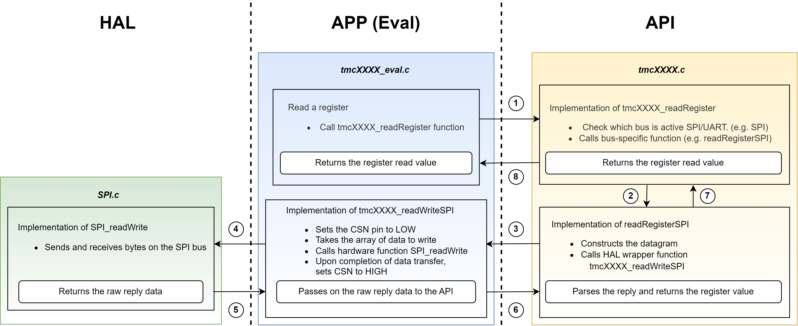

# TMC4671 API - NAMeC copy
This repository is used to keep the latest files from the [TMC-API](https://github.com/analogdevicesinc/TMC-API) but only those of the TMC4671 chip, to be used as an mBed library.

All files contained in this directory, except for the `.last_commit` and `update.sh`, fetching the latest version and committing if there is a new update, come from the original repository. The original README is available below

--
# TMC4671

## How to use

To access the TMC4671's registers, the TMC-API offers two functions: **tmc4671_readRegister** and **tmc4671_writeRegister**.
Each of these functions takes in an **icID**, which is used to identify the IC when multiple ICs are connected. This identifier is passed down to the callback functions (see How to Integrate).

## How to integrate: overview

1. Include all the files of the TMC-API/ic/tmc/TMC4671 folder into the custom project.
2. Include the TMC4671.h file in the custom source code.
3. Implement the necessary callback functions (see below).
4. (optional): Take a look at the Examples subfolder for ready-made examples of the TMC-API usage.

## Accessing the TMC4671 via SPI
The following diagram depicts how to access the TMC4671 via SPI using the TMC-API.

The description of the functions, in the above flowchart, are as follows:
- The functions tmc4671_readRegister and tmc4671_writeRegister are used to read and write the registers respectively. These functions check the current active bus and calls the bus-specific function i.e readRegisterSPI or writeRegisterSPI.
- These bus specific functions constructs the datagram and further calls the bus specific callback 'tmcXXXX_readWriteSPI.
- This callback function further calls the hardware specific read/write function for SPI and needs to be implemented externally.

### How to integrate: Callback functions
Implement the following callback functions to access the chip via SPI:
1. **tmc4671_readWriteSPI()**, which is a HAL wrapper function that provides the necessary hardware access. This function should also set the chip select pin CSN to low before starting the data transfer and set to high upon completion. Please refer to the datasheet of the IC for further details.

## Further info
### Dependency graph for the ICs with new register R/W mechanism
This graph illustrates the relationships between files within the TMC-API library, highlighting dependencies and identifying the files that are essential for integrating the library into the custom projects.

### Example usage: TMC-Evalsystem
**For a reference usage of the TMC-API**, visit the [TMC-Evalsystem](https://github.com/analogdevicesinc/TMC-EvalSystem)

## Migration status
The TMC4671 has been reworked to the access system described above. For more infos on the status of this and other ICs, check out the [migration page](https://github.com/analogdevicesinc/TMC-API/issues/53).

